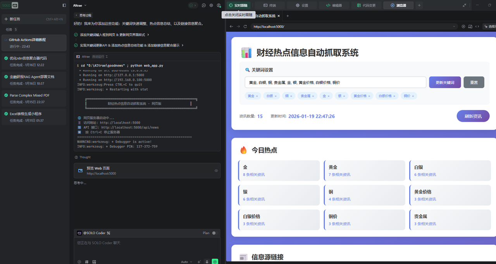

我看到有人利用 n8n信息聚合器.json 这个n8n方案思路，直接采用 GitHub Actions 实现 Claude Agent Skills 云端定时全自动运行与结果网页化整体流程概述：通过 GitHub Actions 触发工作流，在云端自动执行 Claude Agent Skills 来抓取和分析热点信息，然后生成 HTML 报告并部署到 GitHub Pages，最终实现通过网页查看自动化运行结果的效果。
请你分析并规划实现这个方案
